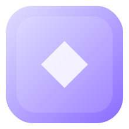

<p align="center">
  
</p>

<h1 align="center">Dwex</h1>

<p align="center">
  A complete Angular UI shell library for building sophisticated application layouts with workspaces, theming, tabs, split views, and more. Built on Angular Material.
</p>

<p align="center">
  
  <a href="https://opensource.org/licenses/MIT">
    
  </a>
  
</p>

## ✨ Features

- **🎨 Theming** — Light/Dark/System modes with 5 color palettes, persisted automatically
- **🗂️ Workspaces** — Switch between multiple navigation contexts from the toolbar
- **📑 Tab System** — Browser-style tabs with pin, reorder (drag & drop), and context menu actions
- **↔️ Split View** — Side-by-side or stacked pane layout with resizable divider
- **👤 Profile Mode** — Built-in profile menu with avatar, name, email, and sign-out
- **📐 Responsive** — Adaptive layout with mobile bottom nav, collapsible sidebar, and three-state desktop sidenav
- **⚙️ Settings Pages** — Pre-built Appearance, Account, Notifications, Privacy, and Advanced pages

## 🚀 Quick Start

Install the package:

```bash
npm install @mydrift/ngx-dwex
```

Add to your app:

```typescript
import { Shell, ShellWorkspace, NavItem } from '@mydrift/ngx-dwex';

@Component({
  selector: 'app-root',
  imports: [Shell],
  template: `
    <dwex-shell
      [workspaces]="workspaces"
      [settingsNavItems]="settingsNav"
      [enableTabs]="true"
      [profileMode]="true"
      userName="Jane Doe"
      userEmail="jane@example.com"
      (signOut)="onSignOut()">
      <div shell-branding>My App</div>
      <div shell-actions><!-- custom buttons --></div>
    </dwex-shell>
  `
})
export class App {
  workspaces: ShellWorkspace[] = [
    {
      id: 'main',
      label: 'Main',
      icon: 'home',
      navItems: [
        { label: 'Dashboard', route: '/dashboard', icon: 'dashboard' },
        { label: 'Profile', route: '/profile', icon: 'person' },
      ]
    }
  ];

  settingsNav: NavItem[] = [
    { label: 'Appearance', route: '/settings/appearance', icon: 'palette' },
  ];

  onSignOut() { /* ... */ }
}
```

## 📖 Documentation

- **[API Reference & Examples](projects/ngx-dwex/README.md)** — Complete library documentation
- **[Customization Guide](CUSTOMIZATION.md)** — Theming, styling, and configuration

## 📦 Project Structure

| Path | Description |
|------|-------------|
| `projects/ngx-dwex/` | Library source (`@mydrift/ngx-dwex`) |
| `projects/dwex-demo/` | Full-featured demo app |
| `projects/dwex-minimal/` | Minimal single-workspace example |

## 💻 Development

### Prerequisites

- Node.js 18+
- Angular CLI 19+

### Setup

```bash
# Clone the repository
git clone https://github.com/mydrift-user/ngx-dwex.git
cd ngx-dwex

# Install dependencies
npm install

# Build the library
ng build ngx-dwex
```

### Run the Demos

```bash
# Full demo — all features
ng serve dwex-demo

# Minimal demo — one workspace, one page
ng serve dwex-minimal
```

Navigate to `http://localhost:4200/`

## 📜 License

This project is licensed under the MIT License. See [LICENSE](LICENSE) for details.

---

Made with ❤️ by [MyDrift](https://github.com/mydrift-user)
